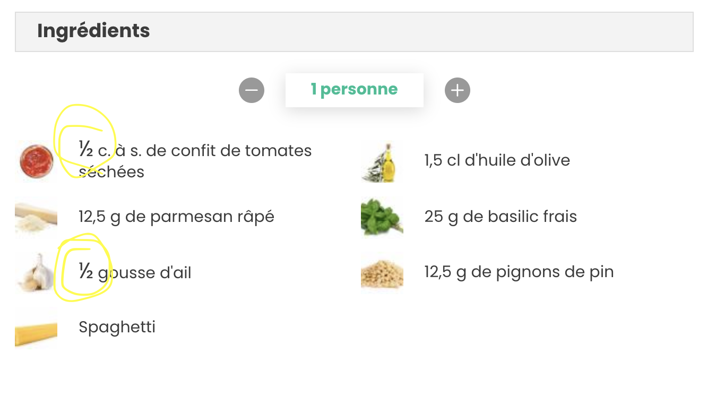

# Fraction kata 🐍🧑‍🍳

Implémentation du kata Fraction en Python dans un contexte de cuisine.

On souhaite gérer des fractions pour afficher des recettes : 

L'example Mapping réalisé par los tres amigos est le suivant : 

### Pour aller plus loin sur ce Kata : 

- https://www.dunod.com/sciences-techniques/software-craft-tdd-clean-code-et-autres-pratiques-essentielles
- https://online-training.jbrains.ca/p/wbitdd-01
- https://sammancoaching.org/kata_descriptions/fractions.html
